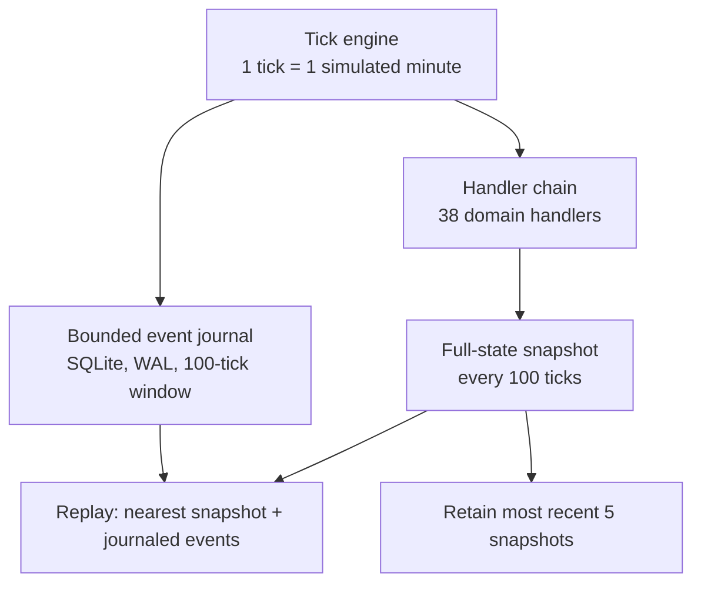
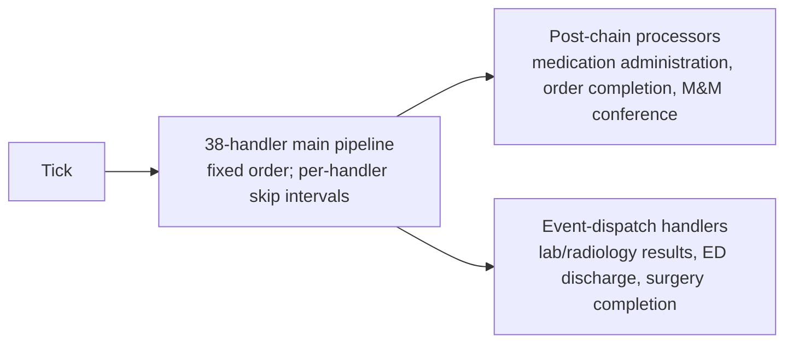
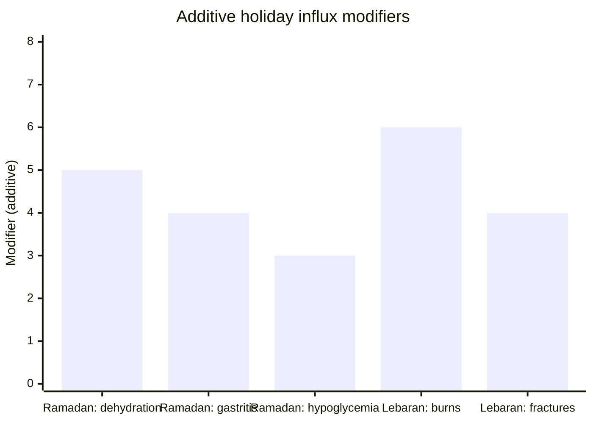
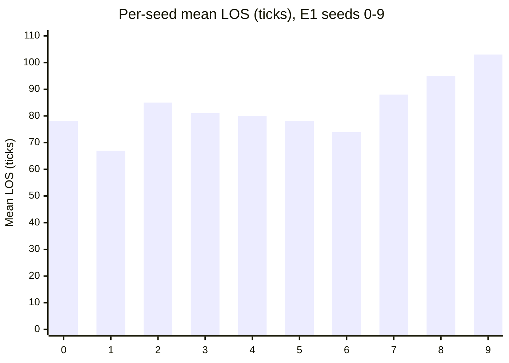

# Deers Rock: A Deterministic Micro-Simulation of a Tier A Referral Hospital in Eastern Indonesia

**Authors:** Riki Rinjani (ORCID 0009-0002-9364-2637)
**Affiliations:** Hisfarma IAI (Himpunan Seminar Farmasi Komunitas Ikatan Apoteker Indonesia)
**Corresponding author:** Riki Rinjani — riki.rinjani@hisfarma.com
**Word count:** 2,136 (main text), 244 (abstract)
**Article type:** JAMIA Research and Applications
**Status:** FINAL — Submission copy (scientific content frozen)

---

## Abstract

**Objective:** We present Deers Rock, a deterministic, open-source micro-simulation of a Tier A referral hospital in Eastern Indonesia, built for reproducible, assumption-transparent health-system experiments.

**Materials and Methods:** The platform combines a deterministic tick engine (one tick = one simulated minute), a bounded SQLite event journal, and a modular chain of 38 domain handlers. A culturally aware calendar engine generates Indonesian holiday-related patient influx. Full-state snapshots are written every 100 ticks, retaining the most recent five; replay reconstructs state from the nearest snapshot plus subsequent journaled events. Patients are procedurally generated (49 unique ICD-10 codes, 22-drug formulary, nine departments, seven disaster types). We evaluated 10 seeded runs of 1,000 ticks.

**Results:** Outcomes were consistent across seeds: mean length of stay 82.9 ticks (SD 10.4), mean deaths per run 4.3 (SD 1.9), mean peak bed occupancy 130.9 of 133 beds (98%). Identical seeds produced identical trajectories (within-environment determinism). Two of ten runs triggered a disaster and had a higher mean death count than the eight non-disaster runs (5.5 vs 4.0) — descriptive, not controlled.

**Discussion:** A seeded hospital micro-simulation can achieve reproducible trajectories while modeling culturally contextualized patient generation, modular departmental composition, and explicit assumptions. Parameters are plausibility-based and uncalibrated; deterministic replay is verified only within the same process and platform.

**Conclusion:** Deers Rock is a reproducible, transparent reference healthcare simulator and the independently executable receiving model in the companion Kronos Engine framework. Clinical calibration remains future work.

**Keywords:** healthcare simulation; deterministic replay; event-driven architecture; Indonesia; reproducibility

---

## 1. Introduction

Healthcare simulation is widely used for policy analysis, rule-based agent development, and health information system prototyping. However, existing simulation platforms share a limitation: they treat simulation outputs as end products rather than instruments that expose the assumptions of the underlying model.

When a hospital simulation produces unexpected results — persistent bed saturation, mortality spikes, supply shortages — the natural response is to treat the output as a bug. But unexpected behavior is not automatically an error. It is a hypothesis. It reveals that some modeling assumption does not match reality. The most valuable simulations are those that make their own assumptions visible.

This principle — simulation as self-critique — drives the design of Deers Rock. The platform is built on three architectural foundations: a deterministic tick engine, a bounded event journal, and a modular handler chain. State transitions are recorded in the journal. Simulations can be replayed from the nearest surviving snapshot and subsequent journal entries.

A second principle follows: counterfactuals by construction. Because the platform is seeded and deterministic, every snapshot is a point of rewind — a fork in history where one variable can be changed while holding everything else constant.

We present Deers Rock, an open-source micro-simulation that models a Tier A referral hospital in Makassar, Eastern Indonesia. The platform integrates 9 specialized departments, 49 unique ICD-10 diagnoses, a 22-drug formulary, and a stochastic disaster scenario engine covering 7 event types. A calendar engine generates culturally-contextualized patient influx — Lebaran burn injuries, Ramadan fasting-related hypoglycemia, seasonal agricultural poisonings — events that stress-test clinical capacity in ways that generic single-department simulators do not model.

The paper makes three contributions. First, we describe the architecture of a healthcare micro-simulation designed for reproducibility, modular composability, and assumption transparency. Second, we demonstrate that the platform produces deterministic trajectories across multiple seeded runs. Third, we show that the platform supports FHIR R4 interoperability for Patient and Observation resources.

## 2. Related Work

**Hospital simulation platforms.** General-purpose frameworks such as SimPy [1] and AnyLogic [2] have been widely used for healthcare modeling. SimPy provides process-based discrete-event simulation but does not include built-in deterministic replay or healthcare-specific data models. AnyLogic offers multi-method simulation but is proprietary and does not provide event-sourced journaling. MedModel [5] is purpose-built for healthcare but is also proprietary. These platforms emphasize different subsets of capabilities; none combines all five properties described in Section 2's gap analysis.

**Open-source healthcare simulators.** Several open-source projects address healthcare simulation. OpenMRS [13] provides an open-source medical record system with simulation capabilities focused on clinical workflow, not hospital operations. Synthea [14] generates synthetic patient data conforming to FHIR standards but does not model departmental workflows, staffing, or disaster scenarios. Python-based hospital simulators on platforms like GitHub (e.g., SimPy-based models) typically implement single-department or single-process simulations. To our knowledge, no open-source platform combines persistent deterministic replay, culturally-contextualized patient generation, modular hospital composition, rule-based clinical agent experimentation, and FHIR interoperability in a single reference implementation.

**AI and reinforcement learning benchmarks.** Komorowski et al. [6] demonstrated RL for sepsis treatment optimization. Medical Gym [7] provides RL environments for clinical decision-making. These environments focus on isolated clinical tasks rather than full hospital operations. Deers Rock embeds rule-based clinical agents within a persistent, multi-department hospital, with an architecture that permits future RL or LLM-based extensions.

**Digital twin platforms.** NHS DIGIT [8] and Siemens Healthineers [9] have developed hospital digital twin prototypes. These are organization-specific, not open-source, and calibrated to specific facilities. Deers Rock is designed as an open-source reference implementation that ships with a locale-specific parameter pack (Eastern Indonesia). We note that Deers Rock does not currently claim digital twin status, as it has not been calibrated to any specific real-world hospital.

**The gap.** The reviewed platforms emphasize different subsets of these capabilities. To our knowledge, no single open-source platform integrates: (1) persistent deterministic replay, (2) culturally-contextualized patient generation, (3) modular composability of clinical departments, (4) rule-based clinical agent experimentation, and (5) FHIR-compliant interoperability in one reference implementation.

## 3. System Architecture

Deers Rock is built on three architectural foundations (Figure 1).

**Tick engine.** The simulation advances in discrete ticks. Each tick represents one simulated minute. The clock is the authoritative timekeeper — no module may advance or delay it. This ensures temporal ordering is deterministic across runs. The clock supports a configurable speed multiplier (default: 60×), which controls how fast simulated time advances relative to wall-clock time. At 60×, one simulated day (1,440 ticks) executes in approximately 24 seconds. The API supports configurable real-time pacing for interactive use.

**Event journal.** State transitions are recorded in a bounded SQLite journal with WAL mode. Each entry captures tick, timestamp, event type, entity type, entity identifier, and a JSON payload. The journal retains events within a configurable rolling window (default: 100 ticks). Older events are purged periodically. Full-state snapshots are serialized every 100 ticks, and only the most recent snapshots are retained (default: 5). Replay from any surviving checkpoint reconstructs state from the nearest snapshot plus subsequent journaled events.

**Handler chain.** Each tick processes the current state through a pipeline of 38 handler functions, each responsible for a specific domain (Figure 2). Handlers are modular state-transition functions that receive the current state, clock, and event queue, and return a new state. Handlers do not communicate directly — they share state only through the state object passed through the chain. Some handlers execute every tick; others run at configurable intervals (every N ticks). Post-chain processors (medication administration, order completion, mortality-morbidity conference) execute after the main pipeline. Event-dispatch handlers (lab results, radiology results, ED discharge, surgery completion) are triggered by queue events rather than running every tick.

> **Figure 1.** System architecture. The tick engine drives a bounded event journal (SQLite, WAL mode) and a 38-handler main pipeline. Snapshots are serialized every 100 ticks. The most recent 5 snapshots are retained; older snapshots and journal events beyond the 100-tick retention window are purged.

> **Figure 2.** Handler pipeline. Each tick processes state through 38 domain handlers in fixed order. Post-chain processors and event-dispatch handlers operate outside the main pipeline. Handler skip intervals (e.g., every 2, 3, 5, 10 ticks) reduce computational overhead for domains that do not require per-tick processing.

## 4. Clinical Model

**4.1 Patient generation.** The patient generator produces Indonesian-contextualized patient profiles using a 50-entry ICD-10 pool (49 unique codes) weighted for Tier A referral hospital admission patterns. Each patient receives age-appropriate vital sign baselines, Indonesian identity data (NIK, address, religion, occupation), blood type with rhesus factor, and drug allergy probabilities. The admission handler uses a Markov process evaluating bed availability, calendar event modifiers, and disaster surge multipliers.

**4.2 Clinical departments.** Nine specialized departments operate concurrently: blood bank, microbiology, pathology, CSSD, biomedical engineering, infection control, clinical nutrition, radiotherapy, and dialysis. Each has independent state, clinical logic, and handler functions, composed into the main pipeline through the handler chain.

**4.3 Rule-based clinical agents.** Three computational clinical agents operate under a clinical constitution. The doctor agent rounds every 4 ticks, assigns specialists via 14-specialty ICD mapping, and generates candidate actions ranked by historical effectiveness. The nurse agent monitors vitals and administers medications. The pharmacist agent reviews orders against drug allergies, contraindications, and interactions. The architecture permits future RL or LLM-based agent extensions.

**4.4 Agent learning loop.** For each discharged patient, the outcome tracker records improvement, deterioration, or death. The learning handler correlates outcomes with actions per ICD code, building a memory of action effectiveness. The doctor agent ranks candidate actions by confidence-weighted success rate. This mechanism is a simple heuristic; the architecture permits integration with RL or LLM-based learning.

**4.5 Disaster scenario engine.** Seven disaster types are modeled: earthquake, forest fire, sunken ship, pandemic, industrial accident, mass casualty, and tsunami. Each progresses through four phases — ramping, sustained, recovering, resolved — affecting patient surge (2–7×), mortality boost (+8–20%), supply demand, and infrastructure damage.

**4.6 Cultural contextualization.** A culturally-aware calendar engine generates patient influx tied to Indonesian holidays (Figure 3). During Ramadan, admissions increase for dehydration, gastritis, and hypoglycemia. During Lebaran, a 1.6× surge introduces burn wounds, fractures, and gastroenteritis. These culturally-contextualized patterns are an architectural capability of the platform: an explicit mechanism for locale-specific contextual modifiers. The specific weight modifiers (+5, +4, +3, 1.6×) are plausibility-based and have not been validated against real hospital admission data.

> **Figure 3.** Cultural calendar effects. Patient influx modifiers during Ramadan (dehydration +5, gastritis +4, hypoglycemia +3) and Lebaran (1.6× surge, burns +6, fractures +4). These modifiers are applied to the base patient generation weights.

## 5. Reproducibility Mechanisms

Reproducibility is enforced at three levels.

**Level 1: Deterministic engine.** All random decisions use a seeded PRNG (mulberry32) initialized from the simulation seed. Within the same process and platform, seed 42 always produces identical trajectories.

**Level 2: Bounded journal.** The journal retains recent events within a configurable rolling window (default: 100 ticks) and periodic full-state snapshots (every 100 ticks, retaining the most recent 5). Replay depends on the nearest surviving snapshot plus subsequent journaled events.

**Level 3: Snapshot and replay.** Snapshots serialize the full hospital state to JSON. A surviving snapshot allows restoring the hospital state at that tick, with subsequent journaled events available for forward replay to the target tick.

**Verification.** Across 10 seeds (0–9) at 1,000 ticks each: average LOS 82.9 ticks (SD 10.4, 95% CI ±6.4), average deaths 4.3 (SD 1.9, 95% CI ±1.2), mean peak bed occupancy 130.9 of 133 beds (98%; SD 2.4). These results demonstrate within-environment reproducibility (same seed = same trajectory) and cross-seed consistency (similar distributions). The near-capacity occupancy is an observed property of the current parameterization, not evidence of realistic hospital utilization, as the model has not been calibrated against facility data. These results do not constitute clinical validation.

## 6. Demonstration

**Reproducibility.** All 10 runs shared identical configuration. The stochastic scenario engine triggered disasters in 2 of 10 runs. These two runs had a higher mean number of deaths than the eight non-disaster runs (5.5 vs. 4.0 deaths per run). This descriptive comparison illustrates the intended operation of the disaster mechanism and is not a controlled estimate of disaster-associated mortality.

**Length of stay.** The average LOS of 82.9 ticks reflects a bimodal distribution: ED fast-track encounters (2–8 ticks) and scheduled inpatient admissions (360–1,440 ticks). Maximum LOS reached 916–992 ticks, confirming inpatient delays function correctly. Per-seed mean LOS across the 10 runs is shown in Figure 4.

**Clinical throughput.** At 1,000 ticks, all handlers processed approximately 780 encounters per run, generating 500 lab orders, 500 medication orders, and 100 surgery orders.

## 7. Availability

Deers Rock is open-source (Apache-2.0). The platform includes:

- **Source code:** TypeScript/Node.js, 2,300+ lines across 54 modules
- **Test suite:** 17 test files (Vitest), 127 tests
- **Documentation:** Architecture docs, API reference, 16 ADRs
- **Experiment data:** 50+ experiment runs in `experiment-results/`
- **Build system:** `npm run build` (tsc), `npm test` (vitest)

Repository: `github.com/rikirinjani/Deers-Rock`

## 8. Limitations

**No clinical calibration.** All patient data is procedurally generated. Diagnosis weights, LOS distributions, and mortality rates are based on published ranges rather than facility-specific data. The platform has not been calibrated against any real hospital. Clinical parameters represent author-assigned plausibility values. Calibration against real hospital data from Eastern Indonesia is ongoing work.

**Cause-of-death attribution.** The mortality model assigns primary diagnosis as cause of death rather than tracing the pathophysiological terminal event. 19% of deaths had implausible attribution for this reason.

**Single-hospital scope.** Deers Rock models a single facility. Multi-hospital federation is a future direction.

**Agent capabilities.** The three clinical agents are rule-based heuristics. The architecture makes RL and LLM extensions feasible, but current agents are baselines.

**Determinism scope.** Deterministic replay is verified within the same process and platform. Cross-platform trajectory identity (e.g., different Node.js versions, different operating systems) has not been tested.

**FHIR coverage.** The FHIR R4 adapter currently serves Patient and Observation resources only. It does not yet expose Encounter, MedicationRequest, or DiagnosticReport resources.

**Limited validation dataset.** Results are based on 10 seeded runs. Longer experiments with more seeds would produce tighter confidence intervals.

## 9. Conclusion

Deers Rock demonstrates that a deterministic, seeded micro-simulation of hospital operations can achieve reproducible trajectories while modeling culturally-contextualized patient generation, modular departmental composition, and transparent assumption exposure. The platform's architecture — deterministic tick engine, bounded event journal, and modular handler chain — enables reproducible policy experiments, rule-based agent benchmarking, and health information system prototyping and interoperability testing.

The platform integrates five properties: persistent deterministic replay, modular composability through 38 independent handlers, culturally-contextualized patient generation, rule-based clinical agent experimentation with outcome-based learning, and FHIR R4 interoperability.

All clinical parameters are plausibility-based. The platform's value lies not in clinical accuracy but in architectural transparency: modeling assumptions are explicit, trajectories are reproducible within the retention window, and simulations can be rewound from surviving snapshots.

Deers Rock subsequently serves as the independently executable receiving simulator within the companion Kronos Engine macro-to-micro framework [15]. That integration is outside the scope of this paper; the two manuscripts address different scientific questions and report non-overlapping results.

Future work includes calibration against real hospital data, multi-hospital federation, LLM-based agent integration, and expanded FHIR resource coverage.

---

## Figures

**Figure 1.** System architecture. The deterministic tick engine drives a bounded event journal (SQLite, WAL mode) and a 38-handler main pipeline. Full-state snapshots are serialized every 100 ticks; the most recent 5 snapshots are retained, and older snapshots and journal events beyond the 100-tick retention window are purged. Replay reconstructs state from the nearest surviving snapshot plus subsequent journaled events.

**Figure 2.** Handler pipeline. Each tick processes state through 38 domain handlers in fixed order. Post-chain processors and event-dispatch handlers operate outside the main pipeline; per-handler skip intervals (e.g. every 2, 3, 5, or 10 ticks) reduce computational overhead for domains that do not require per-tick processing.

**Figure 3.** Cultural calendar effects. Additive patient-influx modifiers applied to the base patient-generation weights during Ramadan (dehydration +5, gastritis +4, hypoglycemia +3) and Lebaran (burns +6, fractures +4). The separate Lebaran surge multiplier (1.6×) is not shown on this additive scale. Modifiers are plausibility-based and have not been validated against real hospital admission data.

**Figure 4.** Per-seed mean length of stay across the 10-seed, 1,000-tick E1 experiment (50 initial patients, seeds 0–9). Mean LOS ranged 67–103 ticks; the two disaster-triggered seeds (3 and 7) are among the higher-death runs. The overall average (82.9 ticks) is pulled below the maximum LOS (916–992 ticks) by high-volume ED fast-track encounters.

---

## References

1. Team SimPy. SimPy: Process-based Discrete-Event Simulation in Python. 2023. Available: https://simpy.readthedocs.io
2. Borshchev A. The Big Book of Simulation Modeling. AnyLogic North America; 2022.
3. Jacobson SH, et al. Discrete-event simulation of health care systems. In: Operations Research for Health Care Delivery. Springer; 2006. p. 215–251.
4. Jun JB, et al. Application of discrete-event simulation in health care clinics. J Oper Res Soc. 1999;50(12):1211–1220.
5. ProModel Corporation. MedModel: Healthcare Simulation Software. Available: https://www.promodel.com/medmodel
6. Komorowski M, et al. The Artificial Intelligence Clinician learns optimal treatment strategies for sepsis in intensive care. Nat Med. 2018;24(11):1649–1654.
7. Gottesman O, et al. Guidelines for reinforcement learning in healthcare. Nat Med. 2019;25(1):16–18.
8. National Health Service. NHS Digital Twin Programme. 2023. Available: https://www.nhsx.nhs.uk
9. Siemens Healthineers. Digital Twin in Healthcare. 2023. Available: https://www.siemens-healthineers.com
10. Gaba DM. The future vision of simulation in health care. Qual Saf Health Care. 2004;13(Suppl 1):i2–i10.
11. Johnson AEW, et al. MIMIC-III, a freely accessible critical care database. Sci Data. 2016;3:160035.
12. Bender D, Sartipi K. HL7 FHIR: An agile and RESTful approach to healthcare information exchange. In: Proc 26th IEEE Int Symp Computer-Based Medical Systems. 2013. p. 326–331.
13. OpenMRS. Open Medical Record System. Available: https://openmrs.org
14. SyntheticMass. Synthea: Patient Generator and Synthetic Medical Records. Available: https://github.com/synthetichealth/synthea
15. Kirinjani R, et al. Kronos Engine: A Deterministic Counterfactual Experimentation Platform with Sentinel Adapter Pattern for Multi-Scale Health System Simulation. Companion manuscript; 2026.

---

**Data availability.** Simulation source code, experiment configuration files, and generated results are available at `github.com/rikirinjani/Deers-Rock` (Apache-2.0). Deterministic replay is verified within the same process and platform; cross-platform trajectory identity has not been tested.

**Ethics.** This study used only synthetic, procedurally generated simulation data. No human subjects or identifiable health information were involved; institutional ethics approval was therefore not required.

**AI disclosure.** Generative AI and AI coding/research assistants were used during this project for software development, experiment orchestration, and manuscript drafting and editing. All AI-generated content was reviewed, verified against the source code and experiment artifacts, and edited by the authors, who take full responsibility for the work. AI tools are not authors.

**Funding.** AUTHOR ACTION REQUIRED.

**Competing interests.** AUTHOR ACTION REQUIRED.

**Acknowledgements.** AUTHOR ACTION REQUIRED.

**Related manuscript.** A companion manuscript (Kronos Engine) describes the macro-to-micro coupling architecture that uses Deers Rock as an independently executable receiving simulator. The two papers address different scientific questions and report non-overlapping results; the companion should be disclosed to the editor.
